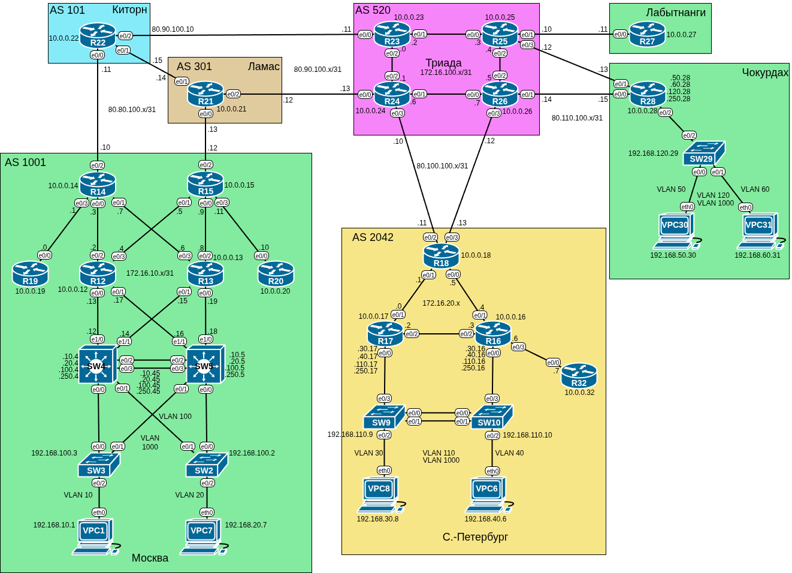

# Домашнее задание «BGP. Фильтрация»

## Цель работы

В данной самостоятельной работе необходимо настроить фильтрацию для офисов «Москва»
и «Санкт-Петербург».

## Задачи

1. [Настроить фильтрацию в офисе «Москва».](#настройка-фильтрации-в-офисе-москва)
2. [Настроить фильтрацию в офисе «Санкт-Петербург».](#настройка-фильтрации-в-офисе-санкт-петербург)
3. [Настроить фильтрацию в провайдере «Киторн».](#настройка-фильтрации-в-провайдере-киторн)
4. [Настроить фильтрацию в провайдере «Ламас».](#настройка-фильтрации-в-провайдере-ламас)
5. [Проверка IP связности всех сетей.](#проверка-ip-связности-всех-сетей)

## Топология

Топология лабораторного стенда собрана в среде EVE-NG.



## Настройка фильтрации в офисе «Москва»

Настроим фильтрацию в офисе «Москва» так, чтобы не появилось транзитного трафика,
используя механизм As-path.

Транзитный трафик может появиться в случае, если провайдеры будут анонсировать
маршруты с префиксом нашей автономной системы в середине списка As-path. Чтобы
избежать этого, настроим фильтрацию на граничных маршрутизаторах **R14** и **R15**.

Создадим access-list, который запрещает все маршруты, содержащие в середине as-path
номер нашей автономной системы (1001):

```text
R14(config)#ip as-path access-list 1 deny _1001_
R14(config)#ip as-path access-list 1 permit .* 
```

Применим его к входящим и исходящим префиксам провайдера «Киторн»:
```text
R14(config)#router bgp 1001
R14(config-router)#neighbor 80.80.100.11 filter-list 1 in
R14(config-router)#neighbor 80.80.100.11 filter-list 1 out
```

То же самое сделаем и на **R15**.

## Настройка фильтрации в офисе «Санкт-Петербург»

Настроим фильтрацию в офисе «Санкт-Петербург» так, чтобы не появилось транзитного
трафика, используя механизм Prefix-list.

Создадим prefix-list, который разрешает только сети, принадлежащие нашей автономной
системе:

```text
R18(config)#ip prefix-list LOC_PREF seq 10 permit 172.16.20.0/24
R18(config)#ip prefix-list LOC_PREF seq 20 permit 192.168.30.0/24
R18(config)#ip prefix-list LOC_PREF seq 30 permit 192.168.40.0/24
R18(config)#ip prefix-list LOC_PREF seq 40 permit 192.168.110.0/24
R18(config)#ip prefix-list LOC_PREF seq 50 permit 10.0.0.16/32     
R18(config)#ip prefix-list LOC_PREF seq 60 permit 10.0.0.17/32
R18(config)#ip prefix-list LOC_PREF seq 70 permit 10.0.0.18/32
R18(config)#ip prefix-list LOC_PREF seq 80 permit 10.0.0.32/32
R18(config)#ip prefix-list LOC_PREF seq 90 permit 0.0.0.0/0
R18(config)#ip prefix-list LOC_PREF seq 100 deny 0.0.0.0/0 le 32
```

Применим его к входящим и исходящим префиксам в сторону провайдера «Триада»:
```text
R18(config)#router bgp 2042
R18(config-router)#neighbor 80.100.100.10 prefix-list LOC_PREF in
R18(config-router)#neighbor 80.100.100.10 prefix-list LOC_PREF out
R18(config-router)#neighbor 80.100.100.12 prefix-list LOC_PREF in 
R18(config-router)#neighbor 80.100.100.12 prefix-list LOC_PREF out
```

## Настройка фильтрации в провайдере «Киторн»

Настроить провайдера «Киторн» так, чтобы в офис «Москва» отдавался только маршрут
по умолчанию.

Создадим префикс-лист, разрешающий только маршрут по умолчанию:

```text
R22(config)#ip prefix-list DEF_ONLY seq 10 permit 0.0.0.0/0
```

Применим его к соседу в офисе «Москва»:

```text
R22(config)#router bgp 101
R22(config-router)#neighbor 80.80.100.10 prefix-list DEF_ONLY out
R22(config-router)#end
```

Теперь маршрутизатор в офисе «Москва» получает от провайдера только один маршрут:

```text
R14#sh ip bgp neighbors 80.80.100.11 routes 
BGP table version is 66, local router ID is 10.0.0.14
Status codes: s suppressed, d damped, h history, * valid, > best, i - internal, 
              r RIB-failure, S Stale, m multipath, b backup-path, f RT-Filter, 
              x best-external, a additional-path, c RIB-compressed, 
Origin codes: i - IGP, e - EGP, ? - incomplete
RPKI validation codes: V valid, I invalid, N Not found

     Network          Next Hop            Metric LocPrf Weight Path
 r   0.0.0.0          80.80.100.11                           0 101 i

Total number of prefixes 1 
R14#
```

## Настройка фильтрации в провайдере «Ламас»

Настроить провайдера «Ламас» так, чтобы в офис «Москва» отдавался только маршрут
по умолчанию и префикс офиса «Санкт-Петербург».

Создадим префикс-лист, разрешающий только маршрут по умолчанию и префикс офиса
«Санкт-Петербург»:

```text
R21(config)#ip prefix-list DEF_AND_SPB seq 10 permit 0.0.0.0/0       
R21(config)#ip prefix-list DEF_AND_SPB seq 20 permit 10.0.0.18/32
```

Применим его к соседу в офисе «Москва»:

```text
R21(config)#router bgp 301
R21(config-router)#neighbor 80.80.100.12 prefix-list DEF_AND_SPB out
R21(config-router)#end
R21#
```

Обновим BGP:

```text
R21#clear ip bgp * soft
```

Теперь маршрутизатор в офисе «Москва» получает от провайдера только два маршрута:

```text
R15#sh ip bgp neighbors 80.80.100.13 routes
BGP table version is 91, local router ID is 10.0.0.15
Status codes: s suppressed, d damped, h history, * valid, > best, i - internal, 
              r RIB-failure, S Stale, m multipath, b backup-path, f RT-Filter, 
              x best-external, a additional-path, c RIB-compressed, 
Origin codes: i - IGP, e - EGP, ? - incomplete
RPKI validation codes: V valid, I invalid, N Not found

     Network          Next Hop            Metric LocPrf Weight Path
 *>  0.0.0.0          80.80.100.13                  200      0 301 i
 *>  10.0.0.18/32     80.80.100.13                  200      0 301 520 2042 ?

Total number of prefixes 2 
R15#
```

## Проверка IP связности всех сетей

IP связность была настроена в предыдущей домашней работе. Убедимся, что ничего
не сломалось:

**VPC1** - **VPC31**

```text
VPC1> ping 192.168.60.31 -c 1

84 bytes from 192.168.60.31 icmp_seq=1 ttl=57 time=2.797 ms
```

**VPC8** - **R27**

```text
VPC8> ping 10.0.0.27 -c 1

84 bytes from 10.0.0.27 icmp_seq=1 ttl=250 time=2.249 ms
```

**R19** - **R32**

```text
R19>ping 10.0.0.32 
Type escape sequence to abort.
Sending 5, 100-byte ICMP Echos to 10.0.0.32, timeout is 2 seconds:
!!!!!
Success rate is 100 percent (5/5), round-trip min/avg/max = 2/3/5 ms
R19>
```

## Файлы настроек

Файлы настроек устройств (конфиги) экспортированы в каталог [configs](./configs/).

Готовая лабораторная (экспорт из EVE-NG) - [08.zip](./08.zip).
